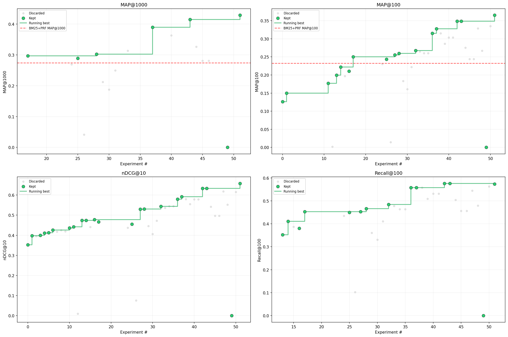

# autoresearch — retrieval



Autonomous retrieval research on Robust04 (TREC 2004). AI agents iterate on retrieval pipelines — BM25, dense bi-encoders, reranking, hybrid fusion — to maximize **MAP@100** on 249 test queries over a 528K document corpus.

## How it works

A multi-agent system coordinates the experiment lifecycle:

| Agent | Role |
|-------|------|
| **Orchestrator** (`CLAUDE.md`) | Picks experiments from plan, dispatches sub-agents |
| **Design** (`.claude/agents/experiment-design.md`) | Creates design docs + initial train.py |
| **Runner** (`.claude/agents/experiment-runner.md`) | Creates worktree, runs experiments |
| **Review** (`.claude/agents/experiment-review.md`) | Data leakage gate, code review, logs results |
| **Cleanup** (`.claude/agents/experiment-cleanup.md`) | Archives artifacts, closes worktree |

Each experiment runs in an isolated git worktree. The review agent enforces data integrity — no test queries or relevance judgments may be used during training.

## Quick start

**Requirements:** NVIDIA GPU (46GB+ recommended), Python 3.10+, [uv](https://docs.astral.sh/uv/).

```bash
# Install dependencies
uv sync

# Install Java (needed for PyTerrier)
bash scripts/install_java.sh

# Download Robust04 and verify MS-MARCO stream (one-time, ~600MB)
uv run prepare.py

# Run the BM25 baseline
uv run train.py
```

## Running the agent

```
Start the experiment loop.
```

The orchestrator reads `docs/plan.md`, picks the next experiment, and dispatches through the Design → Run → Review → Cleanup pipeline.

## Project structure

```
CLAUDE.md               — orchestrator instructions
.claude/agents/         — sub-agent definitions (design, runner, review, cleanup)
prepare.py              — fixed: data loading, evaluation (do not modify)
train.py                — baseline BM25+Bo1 pipeline
docs/plan.md            — prioritized experiment list
docs/ir-survey-202603.md — IR paper survey for experiment ideas
results.tsv             — experiment results log (tab-separated)
progress.png            — auto-generated progress chart
analysis.ipynb          — notebook to regenerate progress.png
scripts/install_java.sh — portable OpenJDK 21 installer
runs/                   — archived run artifacts (gitignored)
worktrees/              — experiment worktrees (gitignored)
```

## License

MIT
